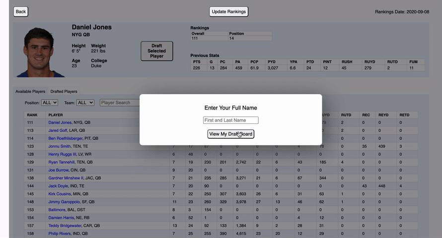
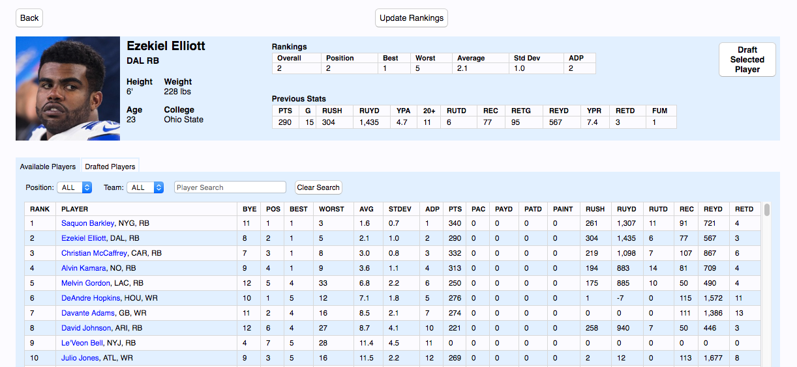

# Fantasy Football Draft Board

[Click here to use the draft board!](http://100.29.78.245/) Create a username and choose your scoring settings to start using the board.

This web application provides the same interactive fantasy football drafting experience as the official draft boards on ESPN, Yahoo, NFL.com, etc., but it uses consensus player rankings consolidated from 100+ experts.

## App Demo



## App Screenshot



## Deployment Guide

### Prerequisites

- An AWS Ubuntu EC2 instance
- A domain name (optional)

### Initial Server Setup

1. SSH into your EC2 instance:

```bash
ssh -i ~/.ssh/id_rsa ubuntu@[YOUR-EC2-PUBLIC-IP]
```

2. Install required packages:

```bash
sudo apt update && sudo apt upgrade -y

# Install Node.js and npm
curl -fsSL https://deb.nodesource.com/setup_20.x | sudo -E bash -
sudo apt install -y nodejs

# Install Rust (press enter to accept defaults)
curl --proto '=https' --tlsv1.2 -sSf https://sh.rustup.rs | sh
source $HOME/.cargo/env

# Install other dependencies
sudo apt install -y nginx postgresql build-essential pkg-config libssl-dev chromium-browser
```

3. Create an SSH key:

```bash
# Generate SSH key (press enter to accept defaults)
ssh-keygen

# Start ssh-agent and add key
eval "$(ssh-agent -s)"
ssh-add ~/.ssh/id_ed25519

# Display public key to copy to GitHub
cat ~/.ssh/id_ed25519.pub
```

4. Add SSH key to GitHub account:

- Go to GitHub → Settings → SSH and GPG keys
- Click "New SSH key"
- Paste the contents of your public key and call it "ffball"
- Test the connection: `ssh -T git@github.com`

5. Set up PostgreSQL:

```bash
sudo systemctl start postgresql
sudo -u postgres psql -c "CREATE USER ffball WITH SUPERUSER CREATEDB CREATEROLE LOGIN PASSWORD 'ffball';"
sudo -u postgres createdb -O ffball ffball

# Update config file (version number might differ)
sudo nano /etc/postgresql/16/main/pg_hba.conf
```

Paste the following config into the file:

```conf
# Database administrative login by Unix domain socket
local   all             postgres                                peer

# TYPE  DATABASE        USER            ADDRESS                 METHOD

# "local" is for Unix domain socket connections only
local   all             all                                     md5
# IPv4 local connections:
host    all             all             127.0.0.1/32            md5
# IPv6 local connections:
host    all             all             ::1/128                 md5
# Allow replication connections from localhost, by a user with the
# replication privilege.
local   replication     all                                     peer
host    replication     all             127.0.0.1/32            scram-sha-256
host    replication     all             ::1/128                 scram-sha-256
```

Restart postgres and confirm you can connect:

```bash
sudo systemctl restart postgresql
PGPASSWORD=ffball psql -U ffball -d ffball
```

6. Clone the repository:

```bash
git clone git@github.com:mengeling/fantasy-football-draft-board-v2.git
cd fantasy-football-draft-board-v2
```

### Backend Setup

1. Set up database and build the backend:

```bash
cd backend
./src/scripts/setup_db.sh
cargo build --release
```

2. Create a systemd service for the backend:

```bash
sudo nano /etc/systemd/system/ffball.service
```

Add the following content:

```ini
[Unit]
Description=Fantasy Football Backend
After=network.target postgresql.service

[Service]
Type=simple
User=ubuntu
Group=ubuntu
Environment="RUST_LOG=info"
Environment="RUST_BACKTRACE=1"
WorkingDirectory=/home/ubuntu/fantasy-football-draft-board-v2/backend
ExecStart=/home/ubuntu/fantasy-football-draft-board-v2/backend/target/release/backend
Restart=always
RestartSec=5
StandardOutput=append:/home/ubuntu/ffball.log
StandardError=append:/home/ubuntu/ffball.log

[Install]
WantedBy=multi-user.target
```

After updating the service file, run:

```bash
# Reload systemd to pick up changes
sudo systemctl daemon-reload

# Make sure the log file exists and has correct permissions
sudo touch /home/ubuntu/ffball.log
sudo chown ubuntu:ubuntu /home/ubuntu/ffball.log
```

### Frontend Setup

1. Install frontend dependencies and build the frontend:

```bash
cd ../frontend
npm install
npm run build

# Set correct permissions for Nginx
sudo chown -R www-data:www-data /home/ubuntu/fantasy-football-draft-board-v2/frontend/build
sudo chmod -R 755 /home/ubuntu/fantasy-football-draft-board-v2/frontend/build
sudo chmod 755 /home/ubuntu
sudo chmod 755 /home/ubuntu/fantasy-football-draft-board-v2
sudo chmod 755 /home/ubuntu/fantasy-football-draft-board-v2/frontend
```

### Nginx Configuration

1. Create Nginx configuration:

```bash
sudo nano /etc/nginx/sites-available/ffball-app
```

Add the following configuration:

```nginx
server {
    listen 80;
    server_name [YOUR_EC2_PUBLIC_IP];  # Replace with your EC2 public IP or domain

    # Frontend - serve static files
    root /home/ubuntu/fantasy-football-draft-board-v2/frontend/build;
    index index.html;

    location / {
        try_files $uri $uri/ /index.html;
    }

    # Backend API
    location /api/ {
        proxy_pass http://127.0.0.1:8080/;
        proxy_http_version 1.1;
        proxy_set_header Upgrade $http_upgrade;
        proxy_set_header Connection 'upgrade';
        proxy_set_header Host $host;
        proxy_cache_bypass $http_upgrade;
    }
}
```

2. Enable the configuration:

```bash
# Create symlink to enable the site
sudo ln -s /etc/nginx/sites-available/ffball-app /etc/nginx/sites-enabled/

# Remove default config if it exists
sudo rm -f /etc/nginx/sites-enabled/default

# Test the configuration
sudo nginx -t

# Restart Nginx
sudo systemctl restart nginx
```

3. Start the backend service:

```bash
sudo systemctl start ffball
sudo systemctl enable ffball
```

### Cron Job Setup

Set up the cron job for daily data updates:

```bash
crontab -e
```

Add:

```
0 0 * * * curl -X POST http://127.0.0.1:8080/fantasy-data/update >> /home/ubuntu/ffball.log 2>&1
```

### SSL Setup (Optional)

To enable HTTPS:

```bash
sudo apt install -y certbot python3-certbot-nginx
sudo certbot --nginx -d your-domain.com
```

### Monitoring

- Backend logs: `sudo journalctl -u ffball`
- Nginx logs: `sudo tail /var/log/nginx/error.log`
